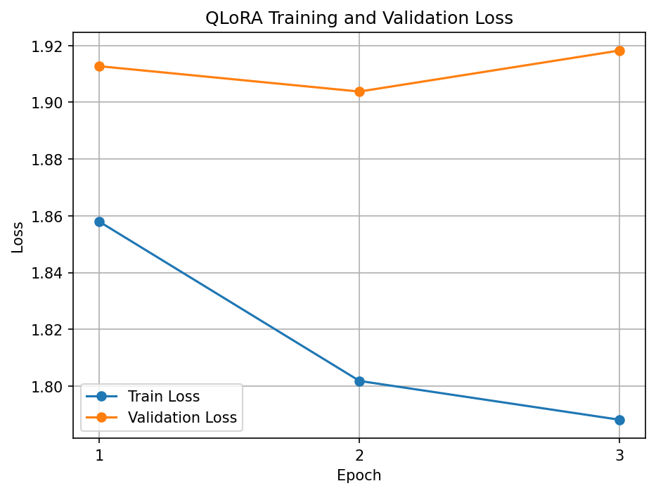

# Mistral-7B QLoRA Fine-Tuning

Fine-tuning **Mistral-7B-Instruct-v0.3** with **QLoRA** on a custom instruction-response dataset.

<p align="center">
  
  
  
  
  
  
</p>

---

##  Overview

This project explores **parameter-efficient fine-tuning of a 7B language model** using QLoRA.

Instead of updating all model parameters, the base model is loaded in **4-bit precision** and only a small LoRA adapter is trained.

### Pipeline

```text
Custom Dataset
      ↓
Cleaning & Deduplication
      ↓
500 Instruction / Response Examples
      ↓
Train / Validation Split
      ↓
Mistral-7B-Instruct-v0.3
      ↓
4-bit Quantization
      ↓
LoRA
      ↓
QLoRA Fine-Tuning
      ↓
Evaluation
      ↓
Base vs Fine-Tuned
```

---

##  Dataset

The final dataset contains **500 instruction-response examples**.

|      Split | Examples |
| ---------: | -------: |
|   Training |      450 |
| Validation |       50 |
|  **Total** |  **500** |

Each example contains:

```text
instruction
response
```

### Data preparation

* Duplicate removal
* Quality filtering
* JSONL export
* Train / validation split

---

##  Model & QLoRA

**Base model**

`mistralai/Mistral-7B-Instruct-v0.3`

**Quantization**

4-bit BitsAndBytes

**LoRA target modules**

```python
target_modules = ["q_proj", "v_proj"]
```

### LoRA configuration

```python
LoraConfig(
    r=8,
    lora_alpha=16,
    lora_dropout=0.05,
    target_modules=["q_proj", "v_proj"],
    task_type="CAUSAL_LM"
)
```

### Parameter efficiency

| Parameter            |         Value |
| -------------------- | ------------: |
| Total parameters     | 7,251,431,424 |
| Trainable parameters |     3,407,872 |
| Trainable percentage |       0.0470% |

The original Mistral weights remained frozen during training.

---

##  Training Configuration

| Setting               |           Value |
| --------------------- | --------------: |
| Epochs                |               3 |
| Train batch size      |               2 |
| Evaluation batch size |               2 |
| Gradient accumulation |               4 |
| Learning rate         |          `2e-4` |
| Max sequence length   |             512 |
| GPU                   | NVIDIA Tesla T4 |

---

##  Training Results

| Epoch | Train Loss | Validation Loss |
| ----: | ---------: | --------------: |
|     1 |     1.8579 |          1.9127 |
|     2 |     1.8018 |          1.9038 |
|     3 |     1.7881 |          1.9183 |

Training loss decreased across all three epochs.

Validation loss improved slightly by epoch 2 and increased slightly during epoch 3.

### Loss Curve

<p align="center">
  
</p>

---

##  Base vs Fine-Tuned

The original base model and the fine-tuned model were evaluated on the **same questions**.

The comparison results are stored in:

```text
results/base_vs_finetuned.json
```

This allows the effect of the LoRA adapter on generated responses to be inspected directly.

---

##  Project Structure

```text
project/
│
├── adapter/
│   └── mistral-qlora-adapter/
│
├── data/
│   └── train.jsonl
│
├── notebooks/
│   └── 01_dataset.ipynb
│
├── results/
│   ├── loss_curve.png
│   ├── training_metrics.json
│   └── base_vs_finetuned.json
│
├── src/
│   └── evaluate.py
│
├── .gitignore
├── README.md
└── requirements.txt
```

---

##  Tech Stack

**Python** · **PyTorch** · **Transformers** · **PEFT** · **BitsAndBytes** · **Datasets** · **CUDA** · **Google Colab**

---

##  Adapter

Only the trained **LoRA adapter** is stored in this repository.

The full 7B base model is **not** included.

The adapter can be loaded on top of the original Mistral model using PEFT.

---

##  Notebook

The complete experiment is documented in:

```text
notebooks/01_dataset.ipynb
```

The notebook covers:

```text
Dataset
   ↓
Preprocessing
   ↓
Chat Formatting
   ↓
Tokenization
   ↓
4-bit Model Loading
   ↓
LoRA Configuration
   ↓
QLoRA Training
   ↓
Evaluation
```

---

##  Hardware

Training was performed on:

**NVIDIA Tesla T4 — 15 GB VRAM**

Environment:

**Google Colab**

---

##  Key Takeaway

This project demonstrates how **QLoRA can adapt a 7B language model while training only 0.047% of its parameters**, significantly reducing the number of trainable parameters compared with full fine-tuning.
